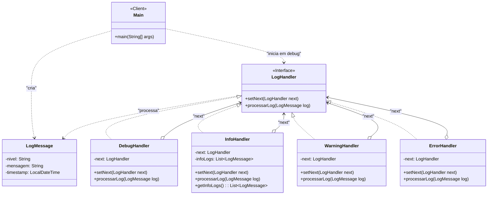

# Sistema de Logs com Padrão Chain of Responsibility

Este projeto demonstra o uso do Padrão de Projeto Comportamental **Chain of Responsibility** (Cadeia de Responsabilidade) para criar um sistema flexível de processamento de logs com múltiplos níveis de severidade.

## O Problema

Um sistema gera logs de diferentes níveis (DEBUG, INFO, WARNING, ERROR), e cada nível exige uma ação diferente (imprimir no console, salvar em arquivo, notificar por e-mail). Implementar isso com uma única classe ou um grande `switch-case` tornaria o código acoplado, difícil de manter e de estender para novos níveis de log.

## A Solução: Chain of Responsibility

O padrão CoR resolve isso criando uma "cadeia" de objetos de processamento (handlers). Cada handler tem a responsabilidade de tratar um tipo específico de solicitação.

-   Uma solicitação (o `LogMessage`) é passada para o início da cadeia.
-   O primeiro handler (`DebugHandler`) verifica se pode processar o log.
-   Se puder, ele o processa.
-   Se não puder, ele passa o log para o próximo handler na cadeia (`InfoHandler`).
-   O processo se repete até que o log seja processado ou a cadeia termine.

Isso desacopla totalmente os handlers uns dos outros e da classe cliente que envia o log.

## Diagrama de Classes da Arquitetura

O diagrama abaixo ilustra a estrutura do padrão CoR aplicada ao sistema de logs.

-   **Client (`Main`)**: Cria a cadeia e envia os `LogMessage`.
-   **`LogHandler`**: A interface que define a cadeia, com métodos `setNext()` e `processarLog()`.
-   **Concrete Handlers**: Cada classe implementa a lógica para seu nível (DEBUG, INFO, etc.) e passa a solicitação para o próximo (`next`) se não puder tratá-la.



## Como Compilar e Executar

### Pré-requisitos
-   Java Development Kit (JDK) 11 ou superior.
-   Visual Studio Code com o **Extension Pack for Java**.

### Executando pelo VS Code (Recomendado)
1.  Abra a pasta raiz do projeto (`log-chain-of-responsibility`) no VS Code.
2.  Aguarde a extensão Java inicializar o projeto.
3.  Abra o arquivo `src/com/logsystem/Main.java`.
4.  Clique no botão **Run** que aparece acima do método `main`.
5.  A saída do console mostrará o processamento dos logs.
6.  Verifique a pasta `logs/` (criada na raiz do projeto) para ver o arquivo `warnings.log`.

### Executando Manualmente pelo Terminal
1.  Abra um terminal na pasta raiz do projeto.
2.  Compile todos os arquivos `.java`:
    ```sh
    javac -d bin src/com/logsystem/**/*.java
    ```
3.  Execute a classe principal:
    ```sh
    java -cp bin com.logsystem.Main
    ```
